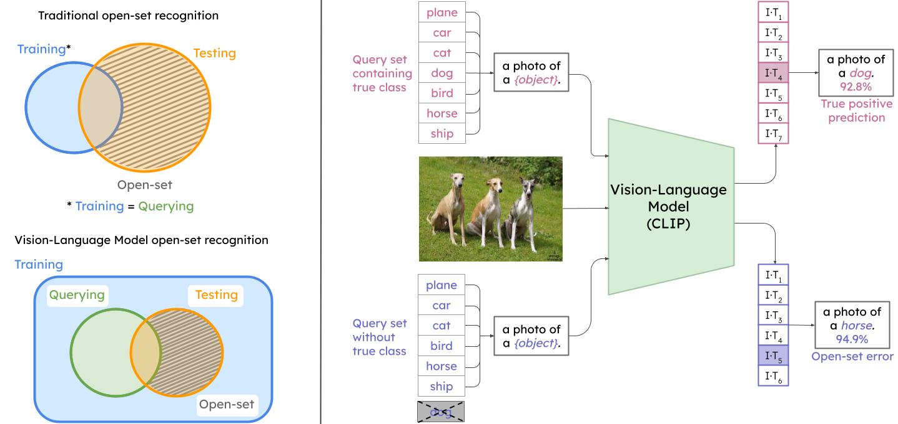

# Open-Set Recognition in the Age of Vision-Language Models

Are vision-language models (VLMs) open-set models because they are trained on internet-scale datasets? No - VLMs introduce closed-set assumptions via their finite query set, making them vulnerable to open-set conditions. 



This repository willl **soon** contain the benchmark evaluation code from the paper:

**Open-Set Recognition in the Age of Vision-Language Models**

*Dimity Miller, Niko Suenderhauf, Alex Kenna, Keita Mason*

To appear at the 2024 European Conference on Computer Vision (ECCV).

[Click here to access the preprint.](https://arxiv.org/pdf/2403.16528)

If you use this work, please cite:

```text
@article{miller2024open,
  title={Open-Set Recognition in the Age of Vision-Language Models},
  author={Miller, Dimity and S{\"u}nderhauf, Niko and Kenna, Alex and Mason, Keita},
  journal={arXiv preprint arXiv:2403.16528},
  year={2024}
}
```


**Contact**

If you have any questions or comments, please contact [Dimity Miller](mailto:d24.miller@qut.edu.au).
