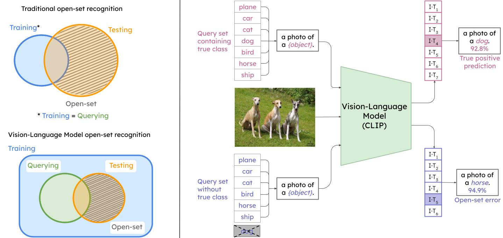

# Open-Set Recognition in the Age of Vision-Language Models

This is the official benchmark code for the ECCV2024 paper [**Open-Set Recognition in the Age of Vision-Language Models**](https://arxiv.org/pdf/2403.16528).



If you use this work, please cite:

```text
@article{miller2024open,
  title={Open-Set Recognition in the Age of Vision-Language Models},
  author={Miller, Dimity and S{\"u}nderhauf, Niko and Kenna, Alex and Mason, Keita},
  journal={arXiv preprint arXiv:2403.16528},
  year={2024}
}
```

**Contact**

If you have any questions or comments, please contact [Dimity Miller](mailto:d24.miller@qut.edu.au).

## Repository Setup

Please navigate to the *classification* or *detection* folder to see the evaluation scripts for their respective experiments in the paper. 

* [Open-Set Classification](https://github.com/dimitymiller/openset_vlms/tree/main/classification)
* [Open-Set Object Detection](https://github.com/dimitymiller/openset_vlms/tree/main/detection)

## Installation

To run the evaluation experiments, you will need an environment that has the below packages. In some cases, we will let you know where other environments are needed (e.g. if you want to test CLIP, ALIGN or ImageBind).
- python
- matplotlib
- seaborn
- numpy
- scipy
- scikit-learn
- json
- argparse
- pycocotools


